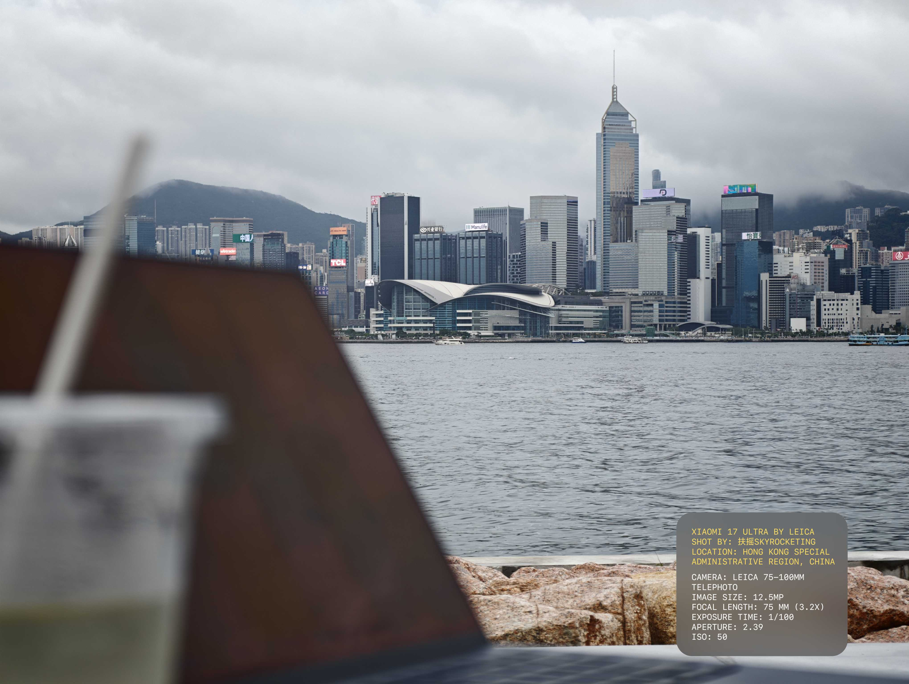
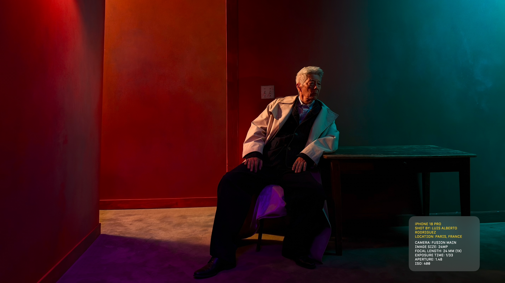
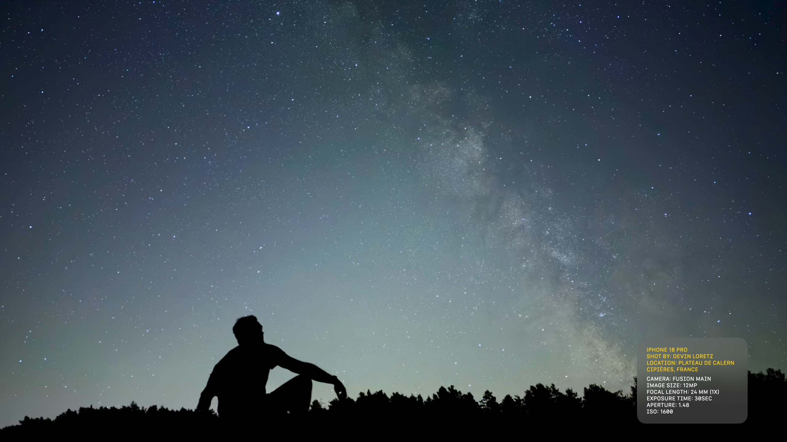
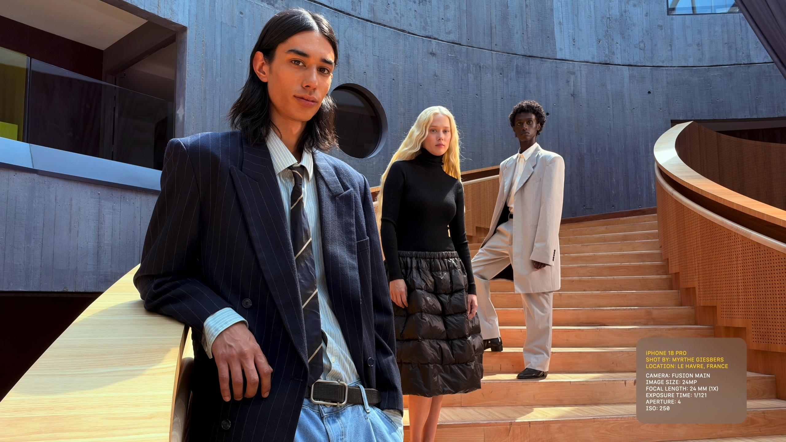

<p align="center">English | <a href="README_ZH.md">简体中文</a></p>
<p align="center"></p>
<h1 align="center">Fuyao Photo Info</h1>
<p align="center">A compact frosted camera-information card, inside the photograph.</p>
<p align="center">
  
  
  
</p>

An Android editor for single photos and batches, with local image processing and optional system place-name lookup. It reads available EXIF metadata and overlays an editable information card without adding a border or changing the photo dimensions. Local build evidence is kept in the ignored `docs/` directory; device/runtime limits are summarized below.

## Showcase

### Exported sample

An exported Hong Kong photo with the app’s inset information card, at **4080 × 3072**. Click the image to open the full-size file.

<p align="center">
  <a href="assets/readme/sample-hong-kong.jpg"></a>
</p>

### Apple keynote references

Apple keynote screenshots show the visual reference for the information card. Each reference is **2560 × 1440**; click a screenshot to view it at full size.

<table>
  <tr>
    <td align="center"><a href="assets/readme/apple-keynote-portrait.png"></a><br>Portrait</td>
    <td align="center"><a href="assets/readme/apple-keynote-night-sky.png"></a><br>Night sky</td>
    <td align="center"><a href="assets/readme/apple-keynote-stairs.png"></a><br>Staircase</td>
  </tr>
</table>

Apple and the credited photographers retain their respective image rights. See [media sources and rights](assets/readme/README.md) and the [Apple-related notice](#apple-related-notice).

## Features

- Save a default photographer in Settings; EXIF Artist takes priority, with an explicit action to apply your default to the current photo.
- Select one or up to 50 photos through the system picker or Files; swipe horizontally to edit each photo independently, then save the whole selection. The app decodes the current preview and exports full-resolution photos sequentially to bound memory use. It normalizes all eight EXIF orientations, including mirrored images.
- Edit device, photographer, location, lens, megapixels, equivalent focal length, exposure, aperture and ISO. Missing fields are omitted. Photo GPS resolves to city/country through the system service; saved user lens profiles and optional 1× calibration format lens magnification. Camera2 inventories visible hardware without capturing; editable profiles store device names, physical/equivalent ranges and zoom endpoints. All values remain editable.
- Render device and credits in warm yellow and capture parameters in white. Monospaced text stays opaque over the blurred, translucent neutral-gray background.
- Scale card geometry with the photo's short edge. Long text wraps along the same left edge; ordinary one-line credit wrapping preserves the reference card size. Longer content expands upward without shrinking or ellipsizing text.
- Adjust card scale and independent text size (80–180%), opacity, blur, corner radius and right/bottom insets. Default text size remains at the reference 100%; increasing text size preserves card width and expands height only as needed. Compare the original and zoom into a full-screen preview.
- Confirm only when leaving with unsaved changes or interrupting ongoing processing; unchanged forms return directly. Reverting edits clears the warning, and successful photo exports update their saved baseline. Exiting the app clears the open session and its private drafts; published photos remain. Cancelled back gestures and cancelled confirmations preserve edits. Save notifications disappear automatically and can also be dismissed.
- Use locally bundled SF Mono Regular when present, or Android monospace otherwise. Import a custom TTF/OTF/TTC and reset to the default font.
- Export a new original-resolution JPEG (quality slider 0–100, default 100) or PNG through the same renderer as the preview. Android 10+ saves to `Pictures/FuyaoPhotoInfo`; Android 8/9 uses Save As for one photo or a folder picker for a batch. Share completed exports through the system share sheet.

The 1527 × 859 reference uses a 215 × 168 card, 77 px right / 35 px bottom inset, 20 px corners, 19 px horizontal padding, 10.5 px text, 12.5 px leading and a 7 px group gap. The backdrop starts at `#5A5A5A` / 60% opacity with 25 px approximate blur. These are reproduction settings from the reference screenshots, not an Apple specification. See [STYLE_SPEC.md](docs/STYLE_SPEC.md).

## Requirements and quick start

- Android 8.0 / API 26 or later.
- JDK 17 or a compatible newer JDK, Android SDK Platform 37, and network access for uncached dependencies.
- Gradle 9.6.1 is provided through the official Wrapper with a pinned distribution checksum.

From the project root:

```bash
# Optional on macOS: copy the local font used by this checkout.
bash scripts/copy-macos-font.sh

# Unit tests, Debug/Release Lint, and Debug/Release APKs.
bash scripts/build-macos.sh
```

The build script recognizes SDK directories named `android-37` or `android-37.0`. Set `JAVA_HOME` and `ANDROID_HOME` when needed. It does not install SDK packages or accept licenses. A failed task exits nonzero; inspect its first error. Extra Gradle arguments can be passed to the script.

Normal Release and Debug builds are installable. Filenames include the version and ABI; use each directory’s `output-metadata.json` as the source of truth. Install the latest universal Release with:

```bash
python3 - <<'PYAPK'
from pathlib import Path
import json, subprocess
metadata = Path('app/build/outputs/apk/release/output-metadata.json')
artifacts = json.loads(metadata.read_text())['elements']
apk = metadata.parent / next(item['outputFile'] for item in artifacts if not item['filters'])
subprocess.run(['adb', 'install', '-r', str(apk)], check=True)
PYAPK
```

An authorized device is required; successful installation prints `Success`. For a signature mismatch, rebuild with the original signing key instead of uninstalling and losing private drafts/settings. To intentionally remove Release, use `adb uninstall ing.fuyaoskyrocket.photoinfo`; exported gallery images remain. `./gradlew clean` removes build outputs without resetting the build counter.

## Variants and signing

| Variant | Application ID suffix | Signing |
| --- | --- | --- |
| Debug | `.debug` | Local debug key; installable |
| Debug Unsigned | `.debug.unsigned` | None |
| Release | None | Private key when configured; otherwise local debug key |
| Release Unsigned | `.unsigned` | None |

Tasks are `assembleDebug`, `assembleDebugUnsigned`, `assembleRelease` and `assembleReleaseUnsigned`. Release uses R8 and resource shrinking. Configure a private key through the ignored `signing.properties`, using `signing.properties.example`. Without private signing properties, Release explicitly uses the local debug key to remain installable, matching the other Fuyao apps. Normal signed builds enable APK v1 and v2. This fallback is a local build, not a production-key release. Unsigned variants cannot be installed. No private signing key is included.

## Versions and APK names

The marketing version is **27.0**, with build train **1A**. Real builds atomically increment the workspace-local `.build-counter`; all variants and ABIs in one invocation share a sequence. Failed builds consume their number. Help, IDE sync and dry-run do not. A fresh workspace starts at sequence 1.

`versionName` is `1Asequence` with non-Release variant suffixes. `versionCode` concatenates marketing base `270` and a sequence padded to at least three digits: `1A4` becomes `270004`. Outputs cover arm64-v8a, armeabi-v7a, x86, x86_64 and universal:

```text
FuyaoPhotoInfo-applicationId-27.0(1Asequence)-ABI-variant.apk
```

## Interface and edge-to-edge

The interface follows the FuyaoLocale / FuyaoColorPicker Material 3 baseline: ColorPicker-style 48dp compact app bars with semibold titles, 28dp action icons and 48dp touch targets, dynamic color and consistent groups. App bars retain status-bar and horizontal cutout insets without extra vertical padding at normal font sizes; larger text can increase the bar height. Photo content uses a 4:3 viewport with Fit scaling and a combined size/media/progress row, with stacked or side-by-side inspector layouts. Lens profiles use a dedicated editor with numeric keyboards, inline validation and deletion undo. Apply edits to the profile draft, then save profiles explicitly.

The editor is the only top-level destination. Its app bar provides Open photos, Save and Settings; About lives in Settings. Existing Navigation Compose handles page and predictive-back transitions. On Android 16+, a non-consuming system-back observer clears unchanged photo sessions while the system handles back-to-home. Unsaved work requires confirmation, including replacing an open photo session.

The workspace adapts to content width, height, font scale and the keyboard. WindowManager separates preview and controls around separating fold hinges; narrow windows keep a stacked layout. Form contents scroll with their insets, and full-screen preview surfaces extend behind system bars. Import, save, preview and font errors provide recovery steps; TalkBack can switch between photos through named actions.

System bars are transparent and insets are consumed once. Backgrounds reach the window edge while final list items and bottom actions remain reachable. Full-screen photos stay in the HDR activity with dark system-bar styling, zoom buttons and interruptible reset. Rendering progress overlays the photo without changing its bounds; field edits and original comparison stay immediate. Exported card styling remains independent from the UI theme.

A single Navigation Compose back stack handles Settings, lens profiles, lens editing and full-screen preview, including predictive back progress and cancellation. With an open session, Back asks to discard only when edits are unsaved or processing is active; a clean session closes directly, and an empty editor leaves back-to-home to Android. Settings and lens pages compare their current values with their initial values before asking. Saving explicitly returns without a second discard prompt. Export options use a Material 3 modal bottom sheet with segmented format selection and a fully clickable metadata row. Actual gesture behavior still requires device validation.

## Technology and project structure

The package prefix, four variants, shared run configurations and bilingual documentation follow [FuyaoColorPicker](https://github.com/skyrocketingHong/FuyaoColorPicker); the README structure also follows [FuyaoLocale](https://github.com/skyrocketingHong/FuyaoLocale). Their application code and image assets were not copied.

AGP 9.2.1 · Gradle 9.6.1 · Compose compiler 2.4.10 · Compose BOM 2026.06.01 · compile/target SDK 37 · ExifInterface 1.4.2. Application ID: `ing.fuyaoskyrocket.photoinfo`.

| Directory | Responsibility |
| --- | --- |
| `data/photo`, `data/export` | Private drafts, EXIF, decoding, encoding and publication |
| `domain/model`, `metadata`, `layout`, `render` | Fields, formatting, geometry and blur |
| `platform` | Android bitmap compositing and font loading |
| `presentation`, `ui` | Saved editor state, operation sequencing and Material 3 controls |
| `scripts`, `.run`, `.github/workflows` | Local checks, builds and CI definition |
| `references` | Local reference screenshots, excluded from source control |

See [metadata recognition](docs/METADATA.md) for GPS, default-photographer and lens-profile behavior. See [ARCHITECTURE.md](docs/ARCHITECTURE.md) for data flow and restoration boundaries. The legacy `install-workspace.py` helper is for importing an extracted package into another workspace; it is unnecessary when already working in this project.

## Configuring lenses

In Settings → Lens profiles, product name and original EXIF model are separate fields. Product name is read from available vendor marketing-name properties, with the public manufacturer/model as a fallback, and remains editable. The EXIF model comes from the current original photo and is the matching identifier; renaming the product does not change that identifier. Android IDs and serial numbers are not read.

Configure native equivalent focal and zoom endpoints separately from the optional maximum digital zoom. For a fixed main lens, native 23–23 mm / 1–1× can cover 2× and 3.1× crops. Physical focal metadata takes priority for lens identity. Without that evidence, explicit digital limits define coverage; otherwise, coverage extends toward the next native lens of the same direction. A last lens has no assumed unlimited digital range. Native-range interpolation and digital scaling retain the actual zoom instead of clamping it to the optical endpoint. Ambiguous overlaps remain unmatched.

Xiaomi 17 Ultra lens configuration example:

| Lens | Native equivalent range | Native zoom | Optional digital maximum |
| --- | --- | --- | --- |
| Main | 23–23 mm | 1–1× | 3.1× |
| Ultra-wide | 14–14 mm | 0.6–0.6× | 0.9× |
| Telephoto | 75–100 mm | 3.2–4.3× | Set the confirmed total maximum if needed |

Physical focal values must be actual Camera2/EXIF millimetres, not the equivalent values above. If missing, leave them blank. Saved legacy profiles retain their IDs and EXIF identity; fixed-focal profiles that used the old upper zoom as a digital limit are migrated to separate native and digital values.

Scanning lists unconfigured hardware only. Configured Camera2 IDs appear with their saved profiles, and a manually created profile can be linked to a scanned lens. Bindings are scoped to the local device model so another device's ID `0` does not hide this device's ID `0`. A Camera2 ID is not treated as an EXIF lens ID. Save the lens editor, then the profile list, and re-import existing photos to apply changed matching rules.

## HDR and Motion Photo preservation

- On Android 14+, recognized JPEG Ultra HDR images retain their gainmap and decoded color space. The card region receives corresponding gainmap edits; unrelated gainmap pixels remain unchanged before JPEG encoding. All base-image drawing, including JPEG background flattening, finishes before the final gainmap is attached: constructing another Canvas would clear it. The encoded gainmap parameters and color space are checked before publication.
- Standard JPEG Motion Photos and compatible legacy Microvideo files retain the complete original MP4/MOV payload, including audio and video metadata, without transcoding. Export verifies the copied payload with SHA-256 and preserves its presentation timestamp.
- HDR Motion Photos retain the GainMap directory item before the video item. EXIF/XMP insertion updates MPF sizes and offsets. Gallery filenames end in `_MP.jpg`.
- PNG export is disabled for HDR/Motion inputs. Unknown auxiliary data, malformed containers, unsupported formats or failed verification stop export rather than silently discarding media.

Prefer importing the complete original through Files; HDR/video already stripped by an upstream provider cannot be recovered. The current preservation path supports JPEG-based containers. HEIC/AVIF preservation, separate-file Apple Live Photos, undocumented vendor motion formats, animated images and high-bit-depth PNG are not supported for export. Android encoding/display, vendor camera enumeration and gallery playback still require device testing. JPEG base and gainmap images are re-encoded; this is not a pixel-lossless workflow. Video bytes are preserved exactly. Sharing apps can subsequently change or flatten the file.

## Fonts, privacy and output limits

This local checkout contains SF Mono Regular copied from the macOS Terminal bundle. It is loaded automatically and embedded in APKs built from this checkout. The font binary and original reference folder are excluded from Git. Selected README images are versioned in `assets/readme/`; their image rights are separate from the source license. A source checkout without the font remains buildable with Android monospace. Runtime imports (up to 10 MB) remain in app-private storage.

The app declares Internet and photo-metadata (`ACCESS_MEDIA_LOCATION`) access, plus optional camera permission for hardware enumeration, with no current-location or broad storage permission. Place lookup can send photo coordinates to the Android system geocoding provider; the photograph itself stays local. Disable lookup in Settings when not needed. Optional capture metadata uses an allowlist excluding GPS, serial numbers, MakerNote, XMP and thumbnails. Editing the visible card does not rewrite original capture tags. Visible names and places remain part of exported image pixels.

Ordinary still images can be exported as JPEG or 8-bit PNG. Ultra HDR and Motion Photo exports follow the preservation path above. Source images are never overwritten. Capture-tag retention excludes GPS from the still-image EXIF; an untouched video retains its own metadata, which can include location information.

Insufficient memory produces an error without silently lowering resolution. Input caps of 512 MB / 200 MP do not guarantee that every device can export those sizes. Batch processing, free dragging and background export services are outside this version.

## Validation

Use `bash scripts/build-macos.sh` for host checks and APKs. It includes `:app:testAndroidDom`, which repeats media-container tests with Android's Harmony DOM implementation to catch differences from desktop Java. Its Android runtime dependency is test-only and is not packaged in APKs; this check does not execute native HDR codecs or replace device testing.

Use `./gradlew :app:connectedDebugAndroidTest` with an authorized device for orientation, pixel-boundary, export-metadata, settings, font-reset and Android 14+ HDR/Motion tests. `scripts/test-core.sh` is an optional offline route requiring Kotlin CLI. See [VALIDATION.md](docs/VALIDATION.md) for actual coverage and remaining device checks. The GitHub workflow has not been run remotely.

## License

Original source is `AGPL-3.0-only`; see [LICENSE](LICENSE) and [NOTICE](NOTICE). Fonts, screenshots and photographs retain their own rights. This is not an Apple product.

## Apple-related notice

Fuyao Photo Info is an independent third-party project. It is not developed, sponsored or endorsed by, or affiliated with, Apple Inc. Apple, iPhone and macOS are trademarks of Apple Inc.; other names and materials remain the property of their respective owners.

References to Apple products, fonts and visual styles describe the project’s references and implementation only. The information-card measurements are estimates from reference images, not official Apple specifications, design resources or a claim of certification.

Apple fonts, including SF Mono, remain subject to their applicable licenses and are not licensed under this project’s AGPL-3.0-only terms. Their availability on macOS, the local copying script and Git exclusion do not grant permission to embed or redistribute them. Before distributing an Android APK containing an Apple font, obtain a license covering that use or build with Android monospace or another appropriately licensed font. This notice itself grants no rights to Apple materials.

See Apple’s [trademark guidelines](https://www.apple.com/legal/intellectual-property/guidelinesfor3rdparties.html), [trademark list](https://www.apple.com/legal/intellectual-property/trademark/appletmlist.html) and [font information and license terms](https://developer.apple.com/fonts/). The license supplied with the particular font or material remains applicable.

## AI-Assisted Development

Generative AI was used to assist with coding during the development of this project.

[](https://github.com/fenxer/llm-things/blob/main/stickers/vibe-pr.svg)
